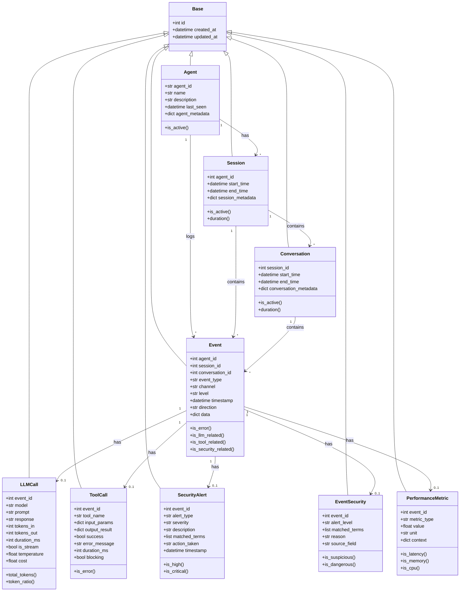

# SQLAlchemy Models

This document provides detailed documentation for the SQLAlchemy models used in the Cylestio Monitor database. These models implement the database schema described in the [Schema Documentation](./schema.md).

## Base Model

The Base model serves as the foundation for all models in the system, providing common attributes and functionality.

```python
class Base:
    """Base model class for all SQLAlchemy models."""
    
    id: Mapped[int] = mapped_column(primary_key=True)
    created_at: Mapped[datetime.datetime] = mapped_column(
        DateTime, 
        default=datetime.datetime.utcnow
    )
    updated_at: Mapped[datetime.datetime] = mapped_column(
        DateTime, 
        default=datetime.datetime.utcnow,
        onupdate=datetime.datetime.utcnow
    )
```

## Agent Model

The Agent model represents an AI agent being monitored by the system.

```python
class Agent(Base):
    """Agent model representing an AI agent being monitored."""
    
    __tablename__ = "agents"
    
    # Override id from Base to add auto-increment
    id: Mapped[int] = mapped_column(primary_key=True, autoincrement=True)
    
    # Agent specific fields
    agent_id: Mapped[str] = mapped_column(
        String(100), 
        unique=True,
        nullable=False
    )
    name: Mapped[Optional[str]] = mapped_column(String(255), nullable=True)
    description: Mapped[Optional[str]] = mapped_column(Text, nullable=True)
    last_seen: Mapped[datetime.datetime] = mapped_column(
        DateTime, 
        default=datetime.datetime.utcnow,
        onupdate=datetime.datetime.utcnow
    )
    agent_metadata: Mapped[Optional[Dict[str, Any]]] = mapped_column(
        JSON,
        comment="Agent configuration and metadata"
    )
    
    # Relationships
    sessions: Mapped[List["Session"]] = relationship(
        "Session", 
        back_populates="agent",
        cascade="all, delete-orphan"
    )
    events: Mapped[List["Event"]] = relationship(
        "Event", 
        back_populates="agent",
        cascade="all, delete-orphan"
    )
    
    # Indexes
    __table_args__ = (
        Index("idx_agents_agent_id", "agent_id", unique=True),
        Index("idx_agents_last_seen", "last_seen"),
    )
```

## Session Model

The Session model represents a distinct execution period of an agent.

```python
class Session(Base):
    """Session model representing execution sessions of an agent."""
    
    __tablename__ = "sessions"
    
    # Override id from Base to add auto-increment
    id: Mapped[int] = mapped_column(primary_key=True, autoincrement=True)
    
    # Session specific fields from schema
    agent_id: Mapped[int] = mapped_column(ForeignKey("agents.id", ondelete="CASCADE"))
    start_time: Mapped[datetime.datetime] = mapped_column(
        DateTime, 
        default=datetime.datetime.utcnow
    )
    end_time: Mapped[Optional[datetime.datetime]] = mapped_column(DateTime, nullable=True)
    session_metadata: Mapped[Optional[Dict[str, Any]]] = mapped_column(
        JSON,
        comment="Flexible session metadata"
    )
    
    # Relationships
    agent: Mapped["Agent"] = relationship("Agent", back_populates="sessions")
    conversations: Mapped[List["Conversation"]] = relationship(
        "Conversation", 
        back_populates="session",
        cascade="all, delete-orphan"
    )
    events: Mapped[List["Event"]] = relationship(
        "Event", 
        back_populates="session",
        cascade="all, delete-orphan"
    )
    
    # Indexes for performance
    __table_args__ = (
        Index("idx_sessions_agent_id", "agent_id"),
        Index("idx_sessions_start_time", "start_time"),
        Index("idx_sessions_end_time", "end_time"),
    )
    
    @property
    def is_active(self) -> bool:
        """Check if the session is currently active.
        
        Returns:
            bool: True if the session is active, False otherwise.
        """
        return self.end_time is None
    
    @property
    def duration(self) -> Optional[float]:
        """Calculate the duration of the session in seconds.
        
        Returns:
            Optional[float]: Duration in seconds, or None if the session is still active.
        """
        if self.end_time is None:
            return None
        return (self.end_time - self.start_time).total_seconds()
```

## Conversation Model

The Conversation model represents a distinct dialogue or interaction flow within a session.

```python
class Conversation(Base):
    """Conversation model representing conversations within sessions."""
    
    __tablename__ = "conversations"
    
    # Override id from Base to add auto-increment
    id: Mapped[int] = mapped_column(primary_key=True, autoincrement=True)
    
    # Conversation specific fields from schema
    session_id: Mapped[int] = mapped_column(ForeignKey("sessions.id", ondelete="CASCADE"))
    start_time: Mapped[datetime.datetime] = mapped_column(
        DateTime, 
        default=datetime.datetime.utcnow
    )
    end_time: Mapped[Optional[datetime.datetime]] = mapped_column(DateTime, nullable=True)
    conversation_metadata: Mapped[Optional[Dict[str, Any]]] = mapped_column(
        JSON,
        comment="Flexible conversation metadata"
    )
    
    # Relationships
    session: Mapped["Session"] = relationship("Session", back_populates="conversations")
    events: Mapped[List["Event"]] = relationship(
        "Event", 
        back_populates="conversation",
        cascade="all, delete-orphan"
    )
    
    # Indexes for performance
    __table_args__ = (
        Index("idx_conversations_session_id", "session_id"),
        Index("idx_conversations_start_time", "start_time"),
        Index("idx_conversations_end_time", "end_time"),
    )
    
    @property
    def is_active(self) -> bool:
        """Check if the conversation is currently active.
        
        Returns:
            bool: True if the conversation is active, False otherwise.
        """
        return self.end_time is None
    
    @property
    def duration(self) -> Optional[float]:
        """Calculate the duration of the conversation in seconds.
        
        Returns:
            Optional[float]: Duration in seconds, or None if the conversation is still active.
        """
        if self.end_time is None:
            return None
        return (self.end_time - self.start_time).total_seconds()
```

## Event Model

The Event model is the core entity representing any monitored occurrence in the system.

```python
class EventType(str, enum.Enum):
    """Enumeration of event types."""
    
    LLM_REQUEST = "llm_request"
    LLM_RESPONSE = "llm_response"
    TOOL_CALL = "tool_call"
    TOOL_RESPONSE = "tool_response"
    USER_MESSAGE = "user_message"
    SYSTEM_MESSAGE = "system_message"
    ERROR = "error"
    WARNING = "warning"
    INFO = "info"
    SECURITY_ALERT = "security_alert"
    PERFORMANCE_METRIC = "performance_metric"
    AGENT_START = "agent_start"
    AGENT_END = "agent_end"
    SESSION_START = "session_start"
    SESSION_END = "session_end"
    CONVERSATION_START = "conversation_start"
    CONVERSATION_END = "conversation_end"


class EventLevel(str, enum.Enum):
    """Enumeration of event severity levels."""
    
    DEBUG = "debug"
    INFO = "info"
    WARNING = "warning"
    ERROR = "error"
    CRITICAL = "critical"


class EventChannel(str, enum.Enum):
    """Enumeration of event channels."""
    
    LLM = "llm"
    TOOL = "tool"
    USER = "user"
    SYSTEM = "system"
    SECURITY = "security"
    PERFORMANCE = "performance"


class EventDirection(str, enum.Enum):
    """Enumeration of event directions."""
    
    INBOUND = "inbound"
    OUTBOUND = "outbound"
    INTERNAL = "internal"


class Event(Base):
    """Event model representing a monitoring event.
    
    This is the core table for all monitoring events in the system,
    with specialized tables linking to it for different event types.
    """
    
    __tablename__ = "events"
    
    # Override id from Base to add auto-increment
    id: Mapped[int] = mapped_column(primary_key=True, autoincrement=True)
    
    # Event specific fields from schema
    agent_id: Mapped[int] = mapped_column(ForeignKey("agents.id", ondelete="CASCADE"))
    session_id: Mapped[Optional[int]] = mapped_column(
        ForeignKey("sessions.id", ondelete="CASCADE"), 
        nullable=True
    )
    conversation_id: Mapped[Optional[int]] = mapped_column(
        ForeignKey("conversations.id", ondelete="CASCADE"), 
        nullable=True
    )
    event_type: Mapped[str] = mapped_column(
        String(50), 
        nullable=False
    )
    channel: Mapped[str] = mapped_column(
        String(50), 
        nullable=False
    )
    level: Mapped[str] = mapped_column(
        String(20), 
        nullable=False
    )
    timestamp: Mapped[datetime.datetime] = mapped_column(
        DateTime, 
        default=datetime.datetime.utcnow
    )
    direction: Mapped[Optional[str]] = mapped_column(
        String(20), 
        nullable=True
    )
    data: Mapped[Optional[Dict[str, Any]]] = mapped_column(
        JSON,
        comment="Additional event data not captured in specialized tables"
    )
    
    # Relationships
    agent: Mapped["Agent"] = relationship("Agent", back_populates="events")
    session: Mapped[Optional["Session"]] = relationship("Session", back_populates="events")
    conversation: Mapped[Optional["Conversation"]] = relationship("Conversation", back_populates="events")
    
    # Specialized event relationships (one-to-one)
    llm_call: Mapped[Optional["LLMCall"]] = relationship(
        "LLMCall", 
        back_populates="event",
        uselist=False,
        cascade="all, delete-orphan"
    )
    tool_call: Mapped[Optional["ToolCall"]] = relationship(
        "ToolCall", 
        back_populates="event",
        uselist=False,
        cascade="all, delete-orphan"
    )
    security_event: Mapped[Optional["EventSecurity"]] = relationship(
        "EventSecurity", 
        back_populates="event",
        uselist=False,
        cascade="all, delete-orphan"
    )
    performance_metric: Mapped[Optional["PerformanceMetric"]] = relationship(
        "PerformanceMetric", 
        back_populates="event",
        uselist=False,
        cascade="all, delete-orphan"
    )
    security_alert: Mapped[Optional["SecurityAlert"]] = relationship(
        "SecurityAlert", 
        back_populates="event",
        uselist=False,
        cascade="all, delete-orphan"
    )
    
    # Indexes for performance
    __table_args__ = (
        Index("idx_events_agent_id", "agent_id"),
        Index("idx_events_session_id", "session_id"),
        Index("idx_events_conversation_id", "conversation_id"),
        Index("idx_events_event_type", "event_type"),
        Index("idx_events_level", "level"),
        Index("idx_events_timestamp", "timestamp"),
    )
    
    @property
    def is_error(self) -> bool:
        """Check if this is an error event.
        
        Returns:
            bool: True for error events, False otherwise.
        """
        return self.level in [EventLevel.ERROR, EventLevel.CRITICAL]
    
    @property
    def is_llm_related(self) -> bool:
        """Check if this event is LLM-related.
        
        Returns:
            bool: True for LLM-related events, False otherwise.
        """
        return self.event_type in [EventType.LLM_REQUEST, EventType.LLM_RESPONSE]
    
    @property
    def is_tool_related(self) -> bool:
        """Check if this event is tool-related.
        
        Returns:
            bool: True for tool-related events, False otherwise.
        """
        return self.event_type in [EventType.TOOL_CALL, EventType.TOOL_RESPONSE]
    
    @property
    def is_security_related(self) -> bool:
        """Check if this event is security-related.
        
        Returns:
            bool: True for security-related events, False otherwise.
        """
        return self.event_type == EventType.SECURITY_ALERT or self.channel == EventChannel.SECURITY
```

## LLM Call Model

The LLM Call model stores detailed information about interactions with Large Language Models.

```python
class LLMCall(Base):
    """LLM Call model representing an LLM API call.
    
    This model stores detailed information about LLM API calls,
    including the model used, prompt, response, tokens, and performance metrics.
    """
    
    __tablename__ = "llm_calls"
    
    # Override id from Base to add auto-increment
    id: Mapped[int] = mapped_column(primary_key=True, autoincrement=True)
    
    # LLM Call specific fields from schema
    event_id: Mapped[int] = mapped_column(
        ForeignKey("events.id", ondelete="CASCADE"), 
        nullable=False
    )
    model: Mapped[str] = mapped_column(String(100), nullable=False)
    prompt: Mapped[str] = mapped_column(Text, nullable=False)
    response: Mapped[str] = mapped_column(Text, nullable=False)
    tokens_in: Mapped[Optional[int]] = mapped_column(Integer, nullable=True)
    tokens_out: Mapped[Optional[int]] = mapped_column(Integer, nullable=True)
    duration_ms: Mapped[Optional[int]] = mapped_column(Integer, nullable=True)
    is_stream: Mapped[bool] = mapped_column(Boolean, default=False)
    temperature: Mapped[Optional[float]] = mapped_column(Float, nullable=True)
    cost: Mapped[Optional[float]] = mapped_column(Float, nullable=True)
    
    # Relationships
    event: Mapped["Event"] = relationship("Event", back_populates="llm_call")
    
    # Indexes for performance
    __table_args__ = (
        Index("idx_llm_calls_event_id", "event_id"),
        Index("idx_llm_calls_model", "model"),
    )
    
    @property
    def total_tokens(self) -> Optional[int]:
        """Calculate the total tokens used (input + output).
        
        Returns:
            Optional[int]: Total tokens or None if token counts are not available
        """
        if self.tokens_in is None or self.tokens_out is None:
            return None
        return self.tokens_in + self.tokens_out
    
    @property
    def token_ratio(self) -> Optional[float]:
        """Calculate the ratio of output tokens to input tokens.
        
        Returns:
            Optional[float]: Ratio or None if token counts are not available
        """
        if self.tokens_in is None or self.tokens_out is None or self.tokens_in == 0:
            return None
        return self.tokens_out / self.tokens_in
```

## Tool Call Model

The Tool Call model stores information about tool/function calls made by the agent.

```python
class ToolCall(Base):
    """Tool Call model representing a tool/function call.
    
    This model stores detailed information about tool calls,
    including input parameters, output results, and performance metrics.
    """
    
    __tablename__ = "tool_calls"
    
    # Override id from Base to add auto-increment
    id: Mapped[int] = mapped_column(primary_key=True, autoincrement=True)
    
    # Tool Call specific fields from schema
    event_id: Mapped[int] = mapped_column(
        ForeignKey("events.id", ondelete="CASCADE"), 
        nullable=False
    )
    tool_name: Mapped[str] = mapped_column(String(100), nullable=False)
    input_params: Mapped[Optional[Dict[str, Any]]] = mapped_column(
        JSON,
        comment="Input parameters to the tool"
    )
    output_result: Mapped[Optional[Dict[str, Any]]] = mapped_column(
        JSON,
        comment="Output result of the tool call"
    )
    success: Mapped[bool] = mapped_column(Boolean, default=True)
    error_message: Mapped[Optional[str]] = mapped_column(Text, nullable=True)
    duration_ms: Mapped[Optional[int]] = mapped_column(Integer, nullable=True)
    blocking: Mapped[bool] = mapped_column(Boolean, default=True)
    
    # Relationships
    event: Mapped["Event"] = relationship("Event", back_populates="tool_call")
    
    # Indexes for performance
    __table_args__ = (
        Index("idx_tool_calls_event_id", "event_id"),
        Index("idx_tool_calls_tool_name", "tool_name"),
    )
    
    @property
    def is_error(self) -> bool:
        """Check if this tool call resulted in an error.
        
        Returns:
            bool: True if the tool call failed, False otherwise.
        """
        return not self.success
```

## Security Models

The security-related models track security alerts and concerns.

```python
class AlertLevel(str, enum.Enum):
    """Enumeration of security alert levels."""
    
    NONE = "none"
    SUSPICIOUS = "suspicious"
    DANGEROUS = "dangerous"


class AlertSeverity(str, enum.Enum):
    """Enumeration of security alert severities."""
    
    LOW = "low"
    MEDIUM = "medium"
    HIGH = "high"
    CRITICAL = "critical"


class EventSecurity(Base):
    """Event Security model for storing security-related information for events.
    
    This model captures security-related information for monitored events,
    including alert levels, matched terms, and reasons for alerts.
    """
    
    __tablename__ = "event_security"
    
    # Override id from Base to add auto-increment
    id: Mapped[int] = mapped_column(primary_key=True, autoincrement=True)
    
    # Event Security specific fields from schema
    event_id: Mapped[int] = mapped_column(
        ForeignKey("events.id", ondelete="CASCADE"), 
        nullable=False
    )
    alert_level: Mapped[str] = mapped_column(String(20), nullable=False)
    matched_terms: Mapped[Optional[List[str]]] = mapped_column(
        JSON,
        comment="Terms that triggered the alert"
    )
    reason: Mapped[Optional[str]] = mapped_column(Text, nullable=True)
    source_field: Mapped[Optional[str]] = mapped_column(String(50), nullable=True)
    
    # Relationships
    event: Mapped["Event"] = relationship("Event", back_populates="security_event")
    
    # Indexes for performance
    __table_args__ = (
        Index("idx_event_security_event_id", "event_id"),
        Index("idx_event_security_alert_level", "alert_level"),
    )
    
    @property
    def is_suspicious(self) -> bool:
        """Check if this event has suspicious alert level.
        
        Returns:
            bool: True for suspicious events, False otherwise.
        """
        return self.alert_level == AlertLevel.SUSPICIOUS
    
    @property
    def is_dangerous(self) -> bool:
        """Check if this event has dangerous alert level.
        
        Returns:
            bool: True for dangerous events, False otherwise.
        """
        return self.alert_level == AlertLevel.DANGEROUS


class SecurityAlert(Base):
    """Security Alert model for high-level security alerts requiring attention.
    
    This model represents higher-level security alerts that require attention,
    often summarizing or aggregating multiple security events.
    """
    
    __tablename__ = "security_alerts"
    
    # Override id from Base to add auto-increment
    id: Mapped[int] = mapped_column(primary_key=True, autoincrement=True)
    
    # Security Alert specific fields from schema
    event_id: Mapped[int] = mapped_column(
        ForeignKey("events.id", ondelete="CASCADE"), 
        nullable=False
    )
    alert_type: Mapped[str] = mapped_column(String(50), nullable=False)
    severity: Mapped[str] = mapped_column(String(20), nullable=False)
    description: Mapped[str] = mapped_column(Text, nullable=False)
    matched_terms: Mapped[Optional[List[str]]] = mapped_column(
        JSON,
        comment="Terms that triggered the alert"
    )
    action_taken: Mapped[Optional[str]] = mapped_column(Text, nullable=True)
    timestamp: Mapped[datetime.datetime] = mapped_column(
        DateTime, 
        default=datetime.datetime.utcnow
    )
    
    # Relationships
    event: Mapped["Event"] = relationship("Event", back_populates="security_alert")
    
    # Indexes for performance
    __table_args__ = (
        Index("idx_security_alerts_event_id", "event_id"),
        Index("idx_security_alerts_alert_type", "alert_type"),
        Index("idx_security_alerts_severity", "severity"),
        Index("idx_security_alerts_timestamp", "timestamp"),
    )
    
    @property
    def is_high(self) -> bool:
        """Check if this alert has high severity.
        
        Returns:
            bool: True for high severity alerts, False otherwise.
        """
        return self.severity == AlertSeverity.HIGH
    
    @property
    def is_critical(self) -> bool:
        """Check if this alert has critical severity.
        
        Returns:
            bool: True for critical severity alerts, False otherwise.
        """
        return self.severity == AlertSeverity.CRITICAL
```

## Performance Metric Model

The Performance Metric model captures performance-related measurements.

```python
class PerformanceMetric(Base):
    """Performance Metric model for storing performance measurements.
    
    This model captures various performance metrics including memory usage,
    CPU utilization, latency, and other resource consumption metrics.
    """
    
    __tablename__ = "performance_metrics"
    
    # Override id from Base to add auto-increment
    id: Mapped[int] = mapped_column(primary_key=True, autoincrement=True)
    
    # Performance Metric specific fields from schema
    event_id: Mapped[int] = mapped_column(
        ForeignKey("events.id", ondelete="CASCADE"), 
        nullable=False
    )
    metric_type: Mapped[str] = mapped_column(String(50), nullable=False)
    value: Mapped[float] = mapped_column(Float, nullable=False)
    unit: Mapped[str] = mapped_column(String(20), nullable=False)
    context: Mapped[Optional[Dict[str, Any]]] = mapped_column(
        JSON,
        comment="Additional context for the metric"
    )
    
    # Relationships
    event: Mapped["Event"] = relationship("Event", back_populates="performance_metric")
    
    # Indexes for performance
    __table_args__ = (
        Index("idx_performance_metrics_event_id", "event_id"),
        Index("idx_performance_metrics_metric_type", "metric_type"),
    )
    
    @property
    def is_latency(self) -> bool:
        """Check if this is a latency-related metric.
        
        Returns:
            bool: True for latency metrics, False otherwise.
        """
        return "latency" in self.metric_type.lower() or "duration" in self.metric_type.lower()
    
    @property
    def is_memory(self) -> bool:
        """Check if this is a memory-related metric.
        
        Returns:
            bool: True for memory metrics, False otherwise.
        """
        return "memory" in self.metric_type.lower()
    
    @property
    def is_cpu(self) -> bool:
        """Check if this is a CPU-related metric.
        
        Returns:
            bool: True for CPU metrics, False otherwise.
        """
        return "cpu" in self.metric_type.lower()
```

## Model Relationships Visualization

The following diagram illustrates the relationships between the SQLAlchemy models:



## Next Steps

Continue to the [Query Patterns Documentation](./query_patterns.md) for detailed information about common query patterns and how to effectively query the database using these models. 