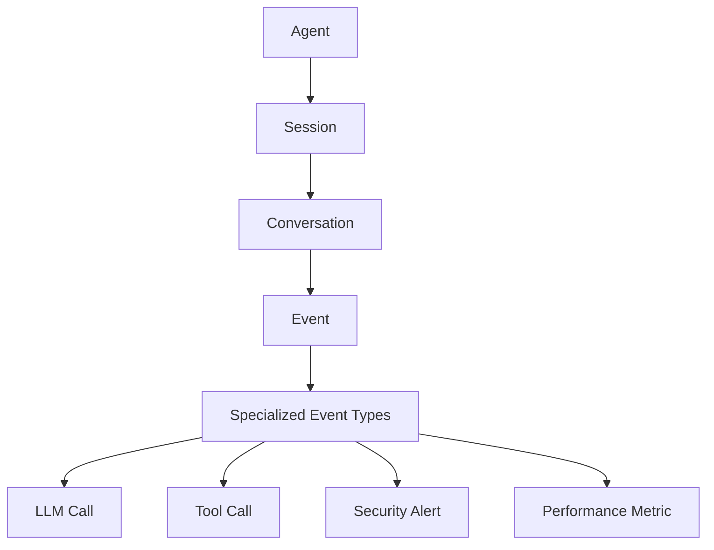
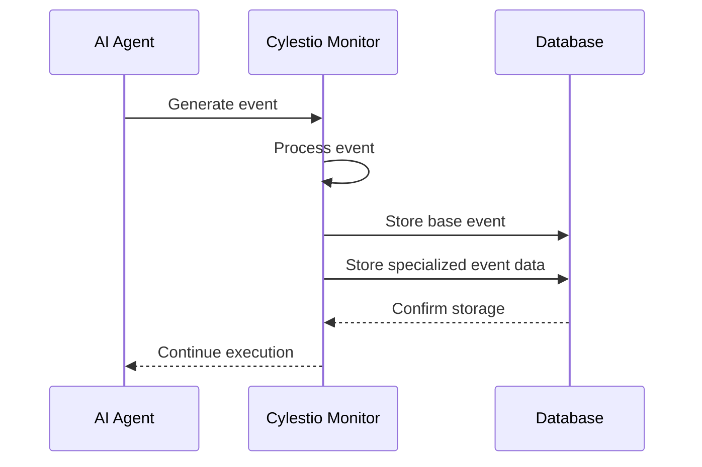

# Database Overview

## Introduction

The Cylestio Monitor database serves as the foundational storage layer for all monitoring events generated by AI agents integrated with the Cylestio Monitor system. It provides a structured way to store, query, and analyze various types of events, from LLM interactions to security alerts, enabling comprehensive monitoring and analysis of AI agent behavior.

## Design Philosophy

The database design follows these key principles:

1. **Event-Centric Architecture**: All monitoring data is stored as events, with specialized tables for different event types.
2. **Hierarchical Organization**: Events are organized in a hierarchical structure (Agent → Session → Conversation → Event).
3. **Extensibility**: The schema allows for easy addition of new event types and properties.
4. **Performance**: Indexes and optimized table structures ensure fast queries even with large volumes of data.
5. **Security**: Proper constraints and validations ensure data integrity and security.

## Core Components

### Key Components:

1. **Agent**: Represents an AI agent being monitored
2. **Session**: A discrete execution period of an agent
3. **Conversation**: A specific dialogue or interaction flow within a session
4. **Event**: The core entity representing any monitored occurrence
5. **Specialized Event Types**: Extension tables for specific event categories

## Data Flow

1. The AI agent generates events during operation
2. Cylestio Monitor captures and processes these events
3. The base event data is stored in the `events` table
4. Additional specialized data is stored in type-specific tables
5. The database acknowledges successful storage
6. The agent continues its execution

## Storage Strategy

The database employs a hybrid storage strategy:

- **Structured Data**: Specific, queryable fields are stored in dedicated columns
- **Semi-Structured Data**: JSON fields store flexible, schema-less data
- **Relationships**: Foreign keys establish connections between related entities
- **Indexing**: Strategic indexes improve query performance for common access patterns

## Technology Stack

The Cylestio Monitor database layer is built on:

- **SQLAlchemy ORM**: For Python-based database interactions
- **SQLite/PostgreSQL**: As the underlying database engine
- **Alembic**: For database migrations and schema versioning

## Scalability Considerations

The database schema is designed with scalability in mind:

1. **Horizontal Partitioning**: Events can be partitioned by time periods
2. **Efficient Indexes**: Optimized for high-volume query patterns
3. **Denormalization**: Strategic denormalization for query performance
4. **Archiving Strategy**: Older events can be archived for long-term storage

## Next Sections

Continue to the [Schema Documentation](./schema.md) for detailed information about tables, relationships, and field definitions. 