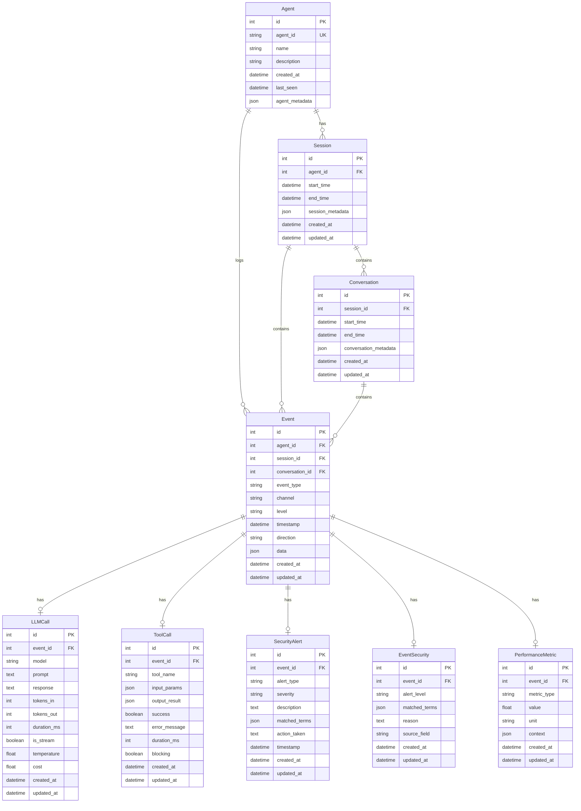

# Database Schema

This document provides a comprehensive overview of the Cylestio Monitor database schema, including entity relationships, table definitions, and field specifications.

## Entity-Relationship Diagram

The following diagram illustrates the relationships between the main entities in the Cylestio Monitor database:



## Table Definitions

### Base Model
All models inherit from a base class that provides common fields:

```sql
CREATE TABLE base_model (
    id INTEGER PRIMARY KEY AUTOINCREMENT,
    created_at TIMESTAMP DEFAULT CURRENT_TIMESTAMP,
    updated_at TIMESTAMP DEFAULT CURRENT_TIMESTAMP
);
```

### Agent Table
```sql
CREATE TABLE agents (
    id INTEGER PRIMARY KEY AUTOINCREMENT,
    agent_id VARCHAR(100) UNIQUE NOT NULL,
    name VARCHAR(255),
    description TEXT,
    created_at TIMESTAMP DEFAULT CURRENT_TIMESTAMP,
    last_seen TIMESTAMP DEFAULT CURRENT_TIMESTAMP,
    agent_metadata JSON,
    CONSTRAINT idx_agents_agent_id UNIQUE (agent_id)
);
CREATE INDEX idx_agents_last_seen ON agents(last_seen);
```

### Session Table
```sql
CREATE TABLE sessions (
    id INTEGER PRIMARY KEY AUTOINCREMENT,
    agent_id INTEGER NOT NULL,
    start_time TIMESTAMP DEFAULT CURRENT_TIMESTAMP,
    end_time TIMESTAMP,
    session_metadata JSON,
    created_at TIMESTAMP DEFAULT CURRENT_TIMESTAMP,
    updated_at TIMESTAMP DEFAULT CURRENT_TIMESTAMP,
    FOREIGN KEY (agent_id) REFERENCES agents(id) ON DELETE CASCADE,
    CONSTRAINT idx_sessions_agent_id FOREIGN KEY (agent_id) REFERENCES agents(id)
);
CREATE INDEX idx_sessions_start_time ON sessions(start_time);
CREATE INDEX idx_sessions_end_time ON sessions(end_time);
```

### Conversation Table
```sql
CREATE TABLE conversations (
    id INTEGER PRIMARY KEY AUTOINCREMENT,
    session_id INTEGER NOT NULL,
    start_time TIMESTAMP DEFAULT CURRENT_TIMESTAMP,
    end_time TIMESTAMP,
    conversation_metadata JSON,
    created_at TIMESTAMP DEFAULT CURRENT_TIMESTAMP,
    updated_at TIMESTAMP DEFAULT CURRENT_TIMESTAMP,
    FOREIGN KEY (session_id) REFERENCES sessions(id) ON DELETE CASCADE,
    CONSTRAINT idx_conversations_session_id FOREIGN KEY (session_id) REFERENCES sessions(id)
);
CREATE INDEX idx_conversations_start_time ON conversations(start_time);
CREATE INDEX idx_conversations_end_time ON conversations(end_time);
```

### Event Table
```sql
CREATE TABLE events (
    id INTEGER PRIMARY KEY AUTOINCREMENT,
    agent_id INTEGER NOT NULL,
    session_id INTEGER,
    conversation_id INTEGER,
    event_type VARCHAR(50) NOT NULL,
    channel VARCHAR(50) NOT NULL,
    level VARCHAR(20) NOT NULL,
    timestamp TIMESTAMP DEFAULT CURRENT_TIMESTAMP,
    direction VARCHAR(20),
    data JSON,
    created_at TIMESTAMP DEFAULT CURRENT_TIMESTAMP,
    updated_at TIMESTAMP DEFAULT CURRENT_TIMESTAMP,
    FOREIGN KEY (agent_id) REFERENCES agents(id) ON DELETE CASCADE,
    FOREIGN KEY (session_id) REFERENCES sessions(id) ON DELETE CASCADE,
    FOREIGN KEY (conversation_id) REFERENCES conversations(id) ON DELETE CASCADE
);
CREATE INDEX idx_events_agent_id ON events(agent_id);
CREATE INDEX idx_events_session_id ON events(session_id);
CREATE INDEX idx_events_conversation_id ON events(conversation_id);
CREATE INDEX idx_events_event_type ON events(event_type);
CREATE INDEX idx_events_level ON events(level);
CREATE INDEX idx_events_timestamp ON events(timestamp);
```

### LLM Call Table
```sql
CREATE TABLE llm_calls (
    id INTEGER PRIMARY KEY AUTOINCREMENT,
    event_id INTEGER NOT NULL,
    model VARCHAR(100) NOT NULL,
    prompt TEXT NOT NULL,
    response TEXT NOT NULL,
    tokens_in INTEGER,
    tokens_out INTEGER,
    duration_ms INTEGER,
    is_stream BOOLEAN DEFAULT FALSE,
    temperature FLOAT,
    cost FLOAT,
    created_at TIMESTAMP DEFAULT CURRENT_TIMESTAMP,
    updated_at TIMESTAMP DEFAULT CURRENT_TIMESTAMP,
    FOREIGN KEY (event_id) REFERENCES events(id) ON DELETE CASCADE
);
CREATE INDEX idx_llm_calls_event_id ON llm_calls(event_id);
CREATE INDEX idx_llm_calls_model ON llm_calls(model);
```

### Tool Call Table
```sql
CREATE TABLE tool_calls (
    id INTEGER PRIMARY KEY AUTOINCREMENT,
    event_id INTEGER NOT NULL,
    tool_name VARCHAR(100) NOT NULL,
    input_params JSON,
    output_result JSON,
    success BOOLEAN DEFAULT TRUE,
    error_message TEXT,
    duration_ms INTEGER,
    blocking BOOLEAN DEFAULT TRUE,
    created_at TIMESTAMP DEFAULT CURRENT_TIMESTAMP,
    updated_at TIMESTAMP DEFAULT CURRENT_TIMESTAMP,
    FOREIGN KEY (event_id) REFERENCES events(id) ON DELETE CASCADE
);
CREATE INDEX idx_tool_calls_event_id ON tool_calls(event_id);
```

### Security Alert Table
```sql
CREATE TABLE security_alerts (
    id INTEGER PRIMARY KEY AUTOINCREMENT,
    event_id INTEGER NOT NULL,
    alert_type VARCHAR(50) NOT NULL,
    severity VARCHAR(20) NOT NULL,
    description TEXT NOT NULL,
    matched_terms JSON,
    action_taken TEXT,
    timestamp TIMESTAMP DEFAULT CURRENT_TIMESTAMP,
    created_at TIMESTAMP DEFAULT CURRENT_TIMESTAMP,
    updated_at TIMESTAMP DEFAULT CURRENT_TIMESTAMP,
    FOREIGN KEY (event_id) REFERENCES events(id) ON DELETE CASCADE
);
CREATE INDEX idx_security_alerts_event_id ON security_alerts(event_id);
CREATE INDEX idx_security_alerts_alert_type ON security_alerts(alert_type);
CREATE INDEX idx_security_alerts_severity ON security_alerts(severity);
CREATE INDEX idx_security_alerts_timestamp ON security_alerts(timestamp);
```

### Event Security Table
```sql
CREATE TABLE event_security (
    id INTEGER PRIMARY KEY AUTOINCREMENT,
    event_id INTEGER NOT NULL,
    alert_level VARCHAR(20) NOT NULL,
    matched_terms JSON,
    reason TEXT,
    source_field VARCHAR(50),
    created_at TIMESTAMP DEFAULT CURRENT_TIMESTAMP,
    updated_at TIMESTAMP DEFAULT CURRENT_TIMESTAMP,
    FOREIGN KEY (event_id) REFERENCES events(id) ON DELETE CASCADE
);
CREATE INDEX idx_event_security_event_id ON event_security(event_id);
CREATE INDEX idx_event_security_alert_level ON event_security(alert_level);
```

### Performance Metric Table
```sql
CREATE TABLE performance_metrics (
    id INTEGER PRIMARY KEY AUTOINCREMENT,
    event_id INTEGER NOT NULL,
    metric_type VARCHAR(50) NOT NULL,
    value FLOAT NOT NULL,
    unit VARCHAR(20) NOT NULL,
    context JSON,
    created_at TIMESTAMP DEFAULT CURRENT_TIMESTAMP,
    updated_at TIMESTAMP DEFAULT CURRENT_TIMESTAMP,
    FOREIGN KEY (event_id) REFERENCES events(id) ON DELETE CASCADE
);
CREATE INDEX idx_performance_metrics_event_id ON performance_metrics(event_id);
```

## Enumeration Values

The database uses several enumeration types for consistent categorization:

### Event Types (EventType)
- `LLM_REQUEST`: LLM API request
- `LLM_RESPONSE`: LLM API response
- `TOOL_CALL`: Function/tool call
- `TOOL_RESPONSE`: Function/tool response
- `USER_MESSAGE`: Message from user
- `SYSTEM_MESSAGE`: System-generated message
- `ERROR`: Error event
- `WARNING`: Warning event
- `INFO`: Informational event
- `SECURITY_ALERT`: Security-related alert
- `PERFORMANCE_METRIC`: Performance measurement
- `AGENT_START`: Agent initialization
- `AGENT_END`: Agent termination
- `SESSION_START`: Session start
- `SESSION_END`: Session end
- `CONVERSATION_START`: Conversation start
- `CONVERSATION_END`: Conversation end

### Event Levels (EventLevel)
- `DEBUG`: Debug-level events
- `INFO`: Informational events
- `WARNING`: Warning events
- `ERROR`: Error events
- `CRITICAL`: Critical events

### Event Channels (EventChannel)
- `LLM`: Large Language Model interactions
- `TOOL`: Tool/function calls
- `USER`: User interactions
- `SYSTEM`: System operations
- `SECURITY`: Security-related events
- `PERFORMANCE`: Performance metrics

### Event Directions (EventDirection)
- `INBOUND`: Incoming data/requests
- `OUTBOUND`: Outgoing data/responses
- `INTERNAL`: Internal system events

### Alert Levels (AlertLevel)
- `NONE`: No security concern
- `SUSPICIOUS`: Potentially concerning
- `DANGEROUS`: Definitely concerning

### Alert Severities (AlertSeverity)
- `LOW`: Low severity alert
- `MEDIUM`: Medium severity alert
- `HIGH`: High severity alert
- `CRITICAL`: Critical severity alert

## JSON Field Structures

### Agent Metadata (agents.agent_metadata)
```json
{
  "version": "string",
  "capabilities": ["string"],
  "config": {
    "key": "value"
  },
  "environment": "string",
  "tags": ["string"]
}
```

### Session Metadata (sessions.session_metadata)
```json
{
  "client_info": {
    "ip": "string",
    "user_agent": "string"
  },
  "context": {
    "key": "value"
  },
  "tags": ["string"],
  "environment": "string"
}
```

### Event Data (events.data)
```json
{
  "message": "string",
  "source": "string",
  "metadata": {
    "key": "value"
  },
  "security": {
    "severity": "string",
    "matches": ["string"],
    "reason": "string",
    "source_field": "string"
  },
  "context": {
    "key": "value"
  },
  "tags": ["string"]
}
```

## Indexes and Performance

The schema includes carefully designed indexes to optimize common query patterns:

### Time-Based Queries
- `idx_events_timestamp`: Optimizes queries filtering by time ranges
- `idx_sessions_start_time` and `idx_sessions_end_time`: Improve session time filtering
- `idx_conversations_start_time` and `idx_conversations_end_time`: Enhance conversation time filtering

### Relationship Navigation
- `idx_events_agent_id`: Speeds up finding all events for a specific agent
- `idx_events_session_id`: Optimizes retrieving events within a session
- `idx_events_conversation_id`: Improves fetching events within a conversation
- `idx_sessions_agent_id`: Accelerates finding sessions for a specific agent
- `idx_conversations_session_id`: Enhances retrieving conversations within a session

### Type and Category Filtering
- `idx_events_event_type`: Optimizes filtering events by type
- `idx_events_level`: Improves filtering events by severity level
- `idx_llm_calls_model`: Enhances finding LLM calls for a specific model
- `idx_security_alerts_alert_type`: Speeds up filtering security alerts by type
- `idx_security_alerts_severity`: Optimizes finding security alerts by severity
- `idx_event_security_alert_level`: Improves filtering security events by alert level

## Next Steps

Continue to the [Models Documentation](./models.md) for detailed information about the SQLAlchemy models that implement this schema. 